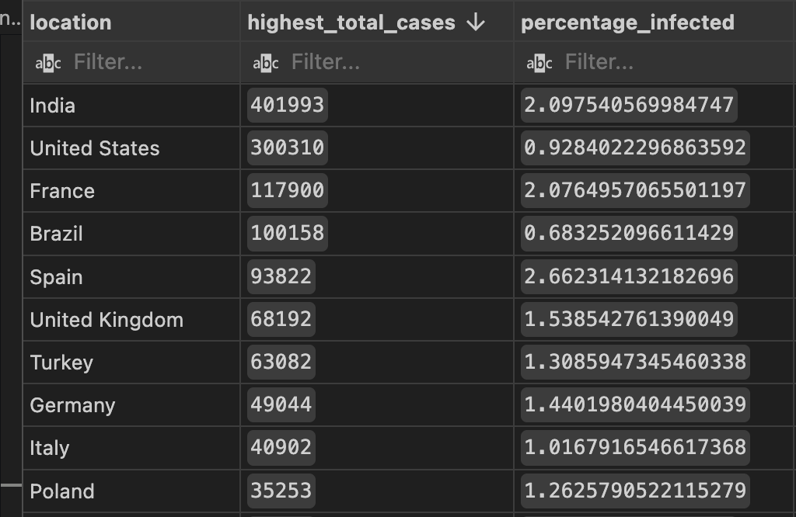
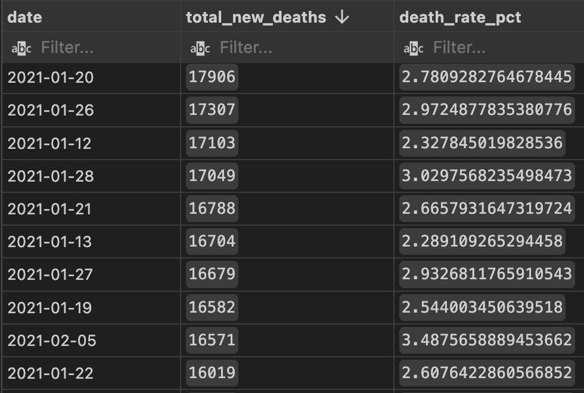
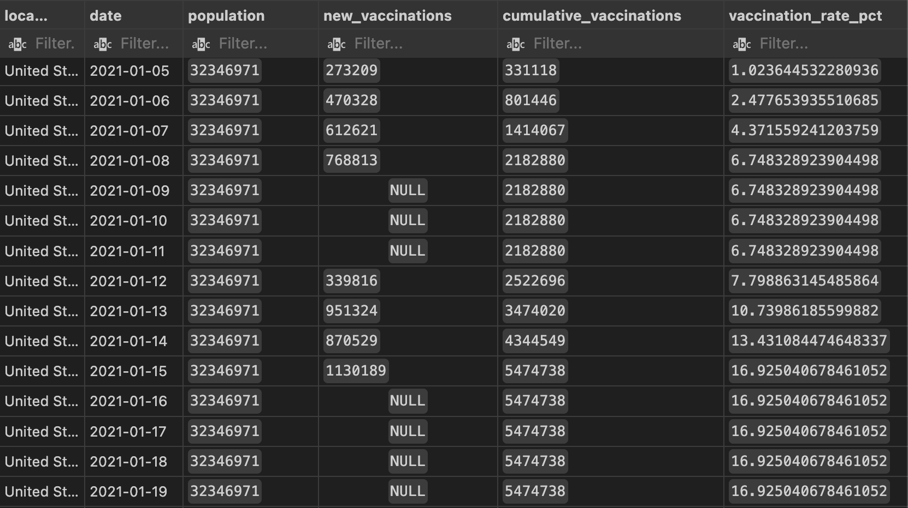

# COVID-19 Data Exploration (PostgreSQL)

## Overview
This project explores global COVID-19 trends using PostgreSQL. The objective was to clean raw datasets, validate joins between deaths and vaccination data, and answer key analytical questions related to infection rates, death rates, and vaccination progress.

The workflow also produces a final reporting view designed for future visualization.

---

## Tools Used
- PostgreSQL
- SQL (Views, Joins, Aggregations, CTEs, Window Functions)
- Data Cleaning & Type Casting
- Reporting View Design (analysis-ready output)

---

## Data Preparation (Views)
The raw tables were imported with many columns stored as TEXT. To support analysis, I created cleaned views that:
- Parsed dates stored as text (e.g., `2/24/20`)
- Cast numeric fields safely using `NULLIF(..., '')::double precision`
- Standardized fields for accurate joins between datasets

---

## Key Analysis Questions
- How did infection rate vary by country (cases vs population)?
- Which countries and continents had the highest total death counts?
- What did global daily death rates look like over time?
- How did vaccination totals accumulate by country over time?
- How can we generate a reporting view ready for visualization?

---

## SQL Highlights

### Cleaned Deaths View
```sql
CREATE VIEW covid_deaths_clean AS
SELECT
    NULLIF(continent, '') AS continent,
    NULLIF(location, '') AS location,
    TO_DATE(date, 'MM/DD/YY') AS date,
    NULLIF(population, '')::double precision AS population,
    NULLIF(total_cases, '')::double precision AS total_cases,
    NULLIF(new_cases, '')::double precision AS new_cases,
    total_deaths::double precision AS total_deaths
FROM covid_deaths;
```

### Cleaned Vaccines View
```sql
CREATE VIEW covid_vaccines_clean AS
SELECT
    NULLIF(location, '') AS location,
    TO_DATE(date, 'MM/DD/YY') AS date,
    NULLIF(new_vaccinations, '')::double precision AS new_vaccinations
FROM covid_vaccines;
```

---

### Highest Infection Rate by Country
```sql
SELECT
    location,
    MAX(total_cases) AS highest_total_cases,
    (MAX(total_cases) / NULLIF(MAX(population), 0)) * 100.0 AS percentage_infected
FROM covid_deaths_clean
WHERE continent IS NOT NULL AND continent <> ''
GROUP BY location
ORDER BY percentage_infected DESC;
```



---

### Global Daily Death Rate
```sql
SELECT
    date,
    SUM(total_deaths) AS total_new_deaths,
    (SUM(total_deaths) / NULLIF(SUM(new_cases), 0)) * 100.0 AS death_rate_pct
FROM covid_deaths_clean
WHERE continent IS NOT NULL AND continent <> ''
GROUP BY date
ORDER BY date;
```



---

### Reporting View: Vaccination Rate (Join + Window Function)
```sql
CREATE VIEW percentpopulation_vaccinated AS
WITH vax AS (
    SELECT
        dea.continent,
        dea.location,
        dea.date,
        MAX(dea.population) OVER (PARTITION BY dea.location) AS population,
        vac.new_vaccinations,
        SUM(vac.new_vaccinations)
            OVER (PARTITION BY dea.location ORDER BY dea.date) AS cumulative_vaccinations
    FROM covid_deaths_clean AS dea
    JOIN covid_vaccines_clean AS vac
        ON dea.location = vac.location
        AND dea.date = vac.date
    WHERE dea.continent IS NOT NULL
      AND dea.continent <> ''
)
SELECT
    continent,
    location,
    date,
    population,
    new_vaccinations,
    cumulative_vaccinations,
    (cumulative_vaccinations / NULLIF(population, 0)) * 100.0 AS vaccination_rate_pct
FROM vax;
```



---

## Project Structure
- `sql/covid_data_exploration.sql` → full cleaning + analysis + reporting queries
- `images/` → representative query output screenshots

---

## Notes
- Many source columns were imported as text and converted via cleaned views.
- In this dataset, `total_deaths` behaved like a daily measure, so totals were calculated using `SUM()` where appropriate.
- The final reporting view was created to support future visualization in tools like Tableau or Power BI.
